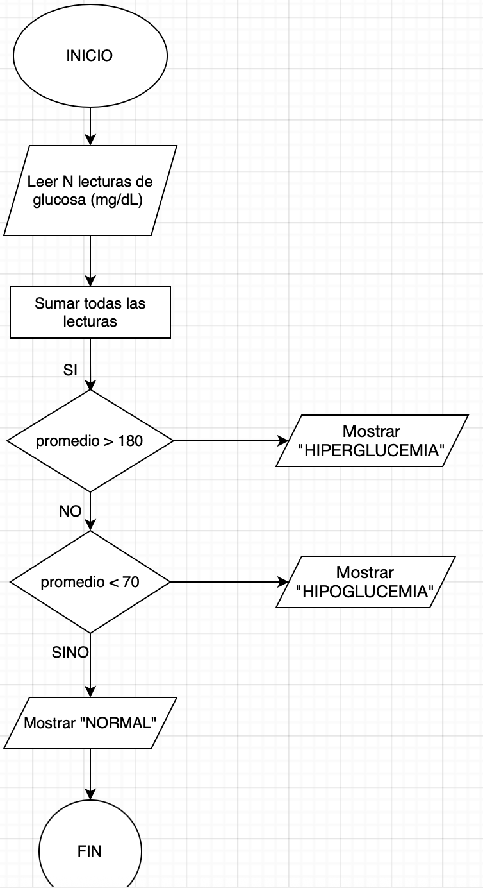
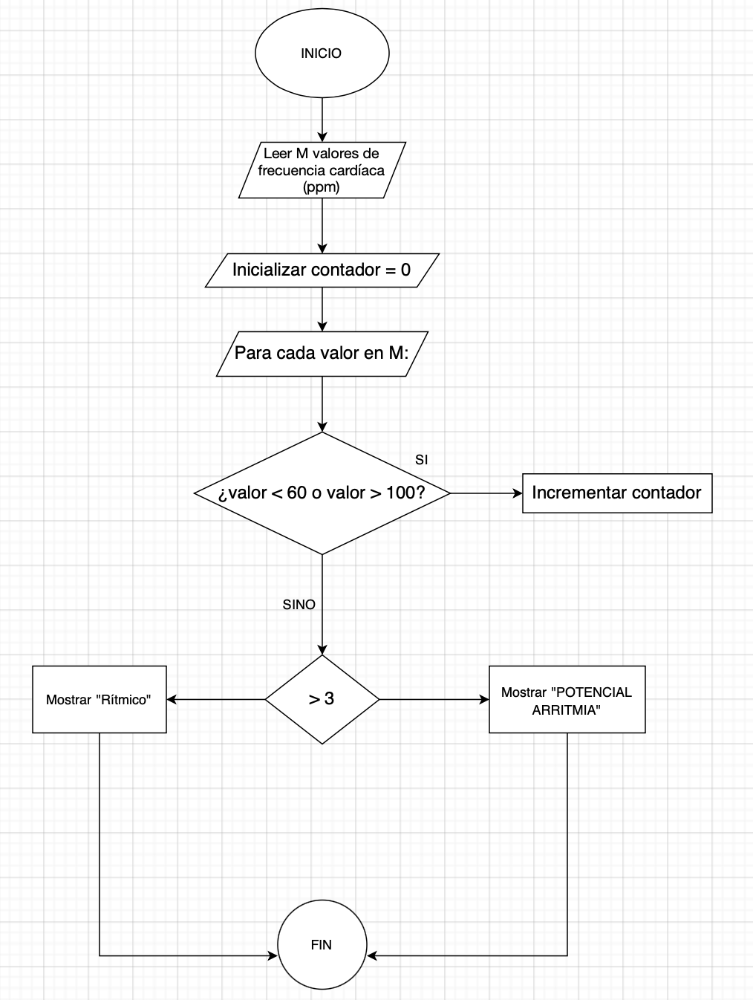
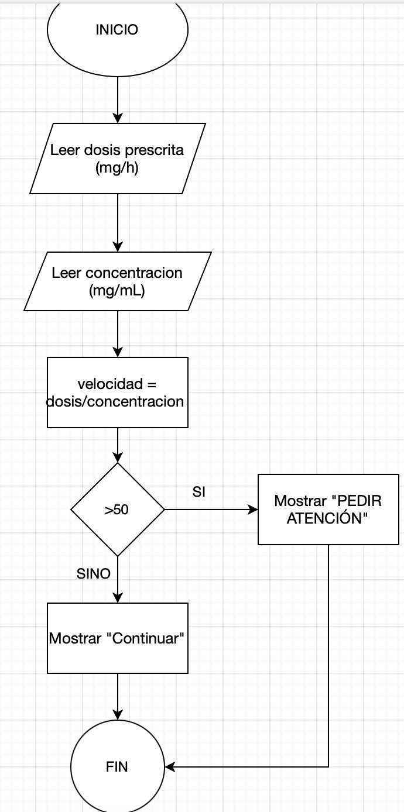

# Casos-de-estudio
1. El código pide varias lecturas de glucosa, calcula el promedio y muestra si hay hiperglucemia, hipoglucemia o un nivel normal, según el valor obtenido.

2. El código lee varios valores de frecuencia cardíaca, cuenta cuántos están fuera del rango normal (menos de 60 o más de 100 ppm) y, según el total, muestra “POTENCIAL ARRITMIA” si hay más de tres fuera de rango, o “Rítmico” si no.

3. El programa recibe como datos una dosis prescrita (mg/h) y una concentración (mg/mL), calcula la velocidad de infusión (mL/h) dividiendo dosis entre concentración y, según el resultado, muestra “PIDER ATENCIÓN” si la velocidad es mayor a 50 mL/h, o “Continuar” si no lo es.

